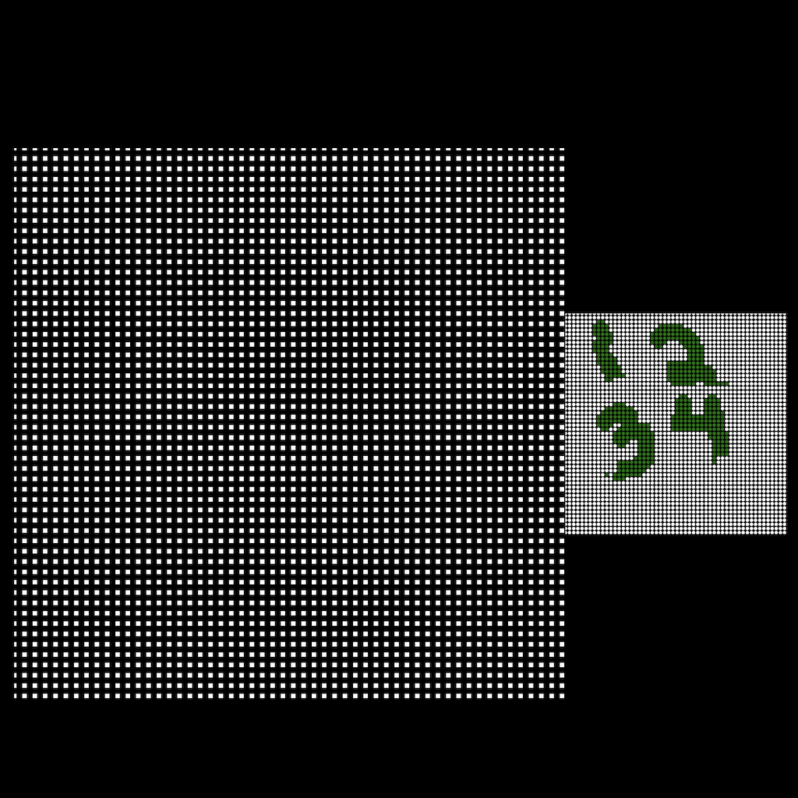
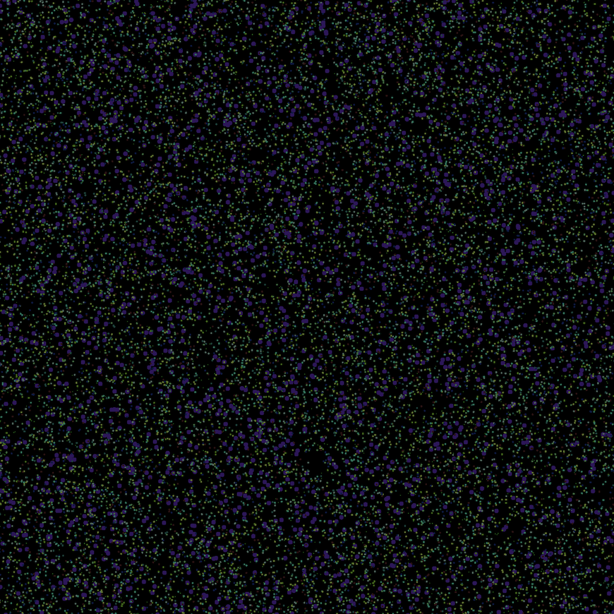
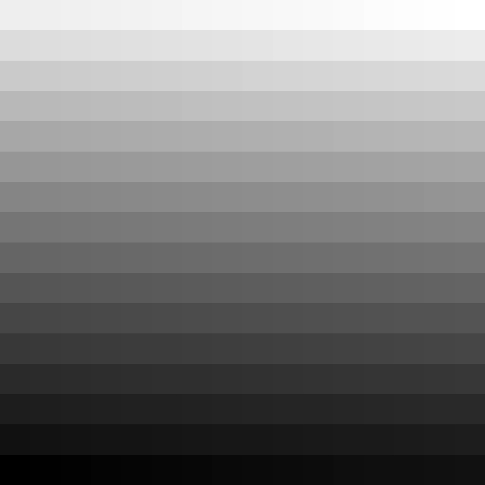

a variety of standalone webgl experiments

## selection-bitmap

interactive visualization that maps a model of selecting items to a webgl texture which is then visualized

## dense-points-toggle

randomized points to test performance with interactivity

## texture-data-buffer-selection

similar to `selection-bitmap` but focuses on just using bits for selection and then visualizing the on/off state

## texture-data-buffer

animated greyscale square backed by an R8 uint8 texture

